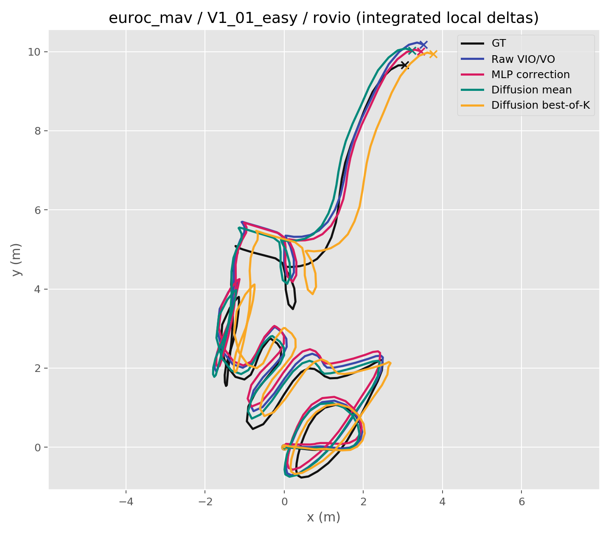
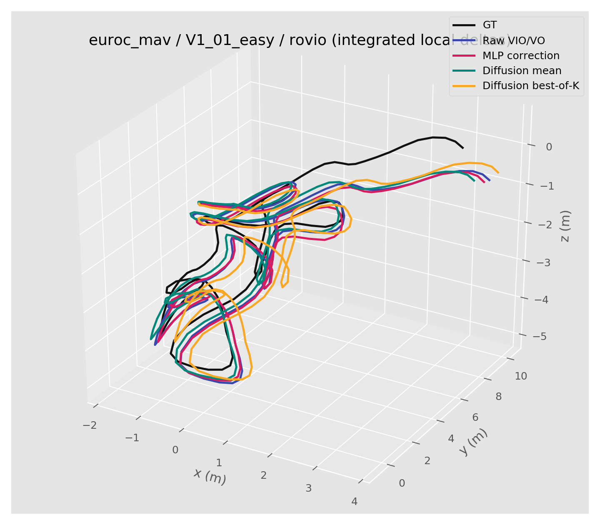

# D^2 PG: Diffusion Degraded Pose Generator

## One-Line Idea

**D^2 PG** treats visual odometry under darkness, motion blur, occlusion, and weak texture as a **conditional generation** problem instead of a brittle deterministic regression problem.

Traditional VO / SLAM front-ends often assume that images contain stable texture, sufficient light, and trackable features. Under severe degradation, feature tracking can collapse, and a deterministic estimator may output a single overconfident wrong pose.

D^2 PG asks a different question:

> Given degraded visual evidence and motion priors, can we generate a plausible distribution of relative poses?

The proposed model uses a conditional diffusion or flow-matching model in a Euclidean pose representation, tentatively `R^9`.

## Core Hypothesis

In degraded visual odometry, the observation may not contain enough information to determine a unique pose. Therefore, pose estimation should model uncertainty:

```text
degraded image pair + optional priors -> distribution over relative pose
```

Instead of predicting one pose directly:

```text
pose = f(image_t, image_{t+1})
```

D^2 PG learns:

```text
p(relative_pose | degraded observations, motion context)
```

## Why Diffusion?

Diffusion models are useful when the output is not a single obvious answer. In degraded VO, many image pairs can become visually ambiguous:

- Motion blur hides feature correspondences.
- Darkness suppresses texture.
- Occlusion removes key regions.
- Textureless walls provide few geometric anchors.

In these cases, direct regression tends to average possible answers. Diffusion can instead sample multiple candidates and attach uncertainty to the estimate.

## Tentative Pose Representation: `R^9`

The phrase `Euclidean space (R^9)` can be made concrete as:

```text
pose vector y = [translation_3d, rotation_6d]
```

where:

- `translation_3d` is relative translation `(tx, ty, tz)`.
- `rotation_6d` is a continuous 6D rotation representation.
- The 6D rotation is decoded back to a valid `SO(3)` rotation matrix.

This avoids running diffusion directly on `SE(3)`, whose geometry is more delicate. The model generates in ordinary Euclidean space, and a final projection converts the result back to a valid pose.

## Trial 1

The first practical goal should be small and testable:

```text
Input: degraded image pair (I_t, I_{t+1})
Output: relative pose delta T_{t -> t+1}
Dataset: existing VO dataset with ground-truth poses
Metric: ATE / RPE / rotation error / translation error
```

The model does not need to beat a full SLAM system at the beginning. A good first milestone is:

> Under synthetic darkness and blur, D^2 PG degrades more gracefully than direct pose regression.

## Executable v0 Pipeline

The current prototype starts with a smaller feasibility check using EPA/AlignAnything trajectories:

```text
VIO/VO local relative pose -> generated correction hypotheses -> closer local GT relative pose
```

This version does not use images yet. It tests whether a generative correction model can produce useful local pose correction candidates from drifting ROVIO/SVO estimates.

Clarification: v0 does not generate an entire trajectory directly. It generates correction candidates for local horizon-20 relative pose deltas, then visualizes the effect by integrating those deltas.

### v0 Framework

```mermaid
flowchart LR
    A[EPA / AlignAnything<br/>EuRoC MAV] --> B[GT trajectory<br/>T_gt]
    A --> C[ROVIO / SVO trajectory<br/>T_vio]
    B --> D[Timestamp association]
    C --> D
    D --> E[Local horizon-20 deltas<br/>x = inv(T_vio_i) T_vio_j<br/>y = inv(T_gt_i) T_gt_j]
    E --> F[Correction target<br/>r = y - x]
    E --> G[Condition<br/>x]
    F --> H[Noising<br/>r_t = (1 - t) r + t eps]
    G --> I[Tiny conditional denoiser<br/>MLP(r_t, t, x)]
    H --> I
    I --> J[K residual samples<br/>r_hat_1 ... r_hat_K]
    J --> K[Corrected local deltas<br/>x + r_hat_k]
    K --> L[Metrics + local trajectory<br/>visualization]
```

Run:

```bash
cd /home/yifu/d2pg
bash scripts/run_smoke.sh
```

Main files:

- `scripts/build_dataset.py`: builds local relative pose correction samples from `epa_data`.
- `scripts/train_correction.py`: trains a deterministic MLP residual baseline.
- `scripts/train_diffusion_correction.py`: trains a tiny conditional diffusion-style correction generator.
- `scripts/visualize_v0.py`: renders metric plots into `artifacts/figures/`.
- `experiments_v0.md`: records the first smoke-test result and interpretation.

Training set summary:

```text
source:  epa_data/AlignAnything EuRoC MAV
inputs:  ROVIO/SVO local horizon-20 relative pose deltas
targets: GT local horizon-20 relative pose deltas
train:   6461 samples
test:    1420 samples
```

The tiny diffusion model learns a residual:

```text
r = GT_delta - VIO_delta
```

Training samples noisy residuals with:

```text
r_t = (1 - t) * r + t * epsilon, epsilon ~ N(0, I)
```

and trains an MLP denoiser:

```text
model(r_t, t, VIO_delta) -> r
```

First result:

```text
raw VIO/VO translation RMSE:       0.0575 m
diffusion best-of-16 translation:  0.0445 m
```

This is not yet a deployable system because best-of-16 uses an oracle choice. It is an early signal that generated correction hypotheses can contain better local motions, so the next important piece is a selector based on temporal or geometric consistency.

### Trajectory Visualization

The trajectory below is a diagnostic integration of local horizon-20 deltas on the default test sequence:

```text
euroc_mav / V1_01_easy / rovio
```

It is not a full SLAM back-end trajectory, but it shows how the generated local corrections affect the integrated path shape.





Integrated local ATE on this visualization:

```text
Raw VIO/VO:          0.5898 m
MLP correction:      0.5945 m
Diffusion mean:      0.4790 m
Diffusion best-of-K: 0.4956 m
```

Visual report:

- `artifacts/figures/translation_bar.png`
- `artifacts/figures/translation_hist.png`
- `artifacts/figures/uncertainty_vs_gain.png`
- `artifacts/figures/rotation_bar.png`
- `artifacts/figures/trajectory_xy.png`
- `artifacts/figures/trajectory_3d.png`
