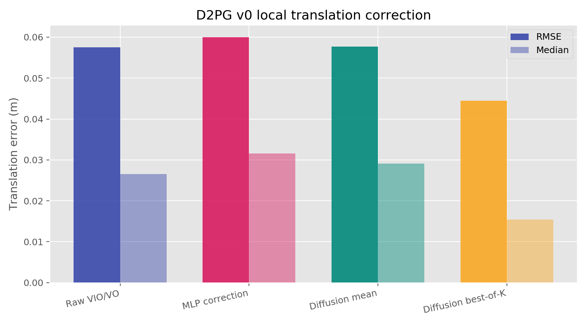
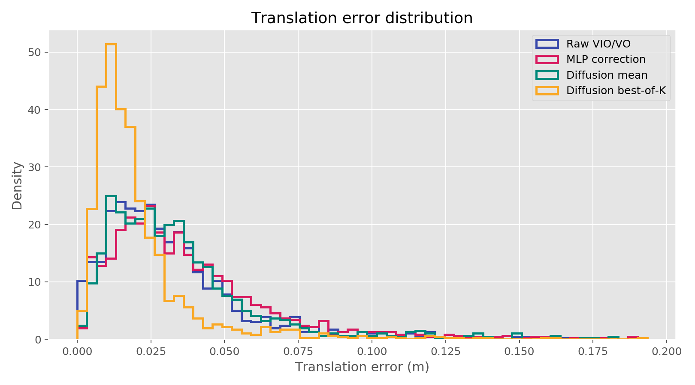
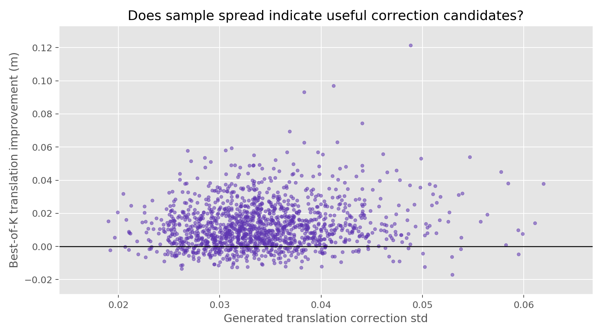
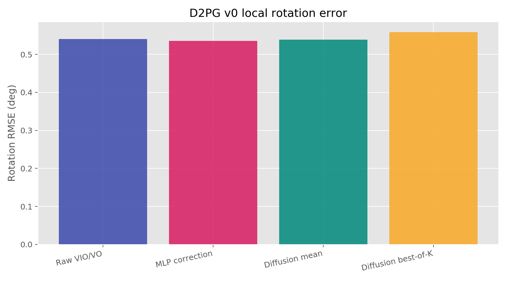

# D2PG v0 Pipeline

This is the first executable feasibility check for D2PG.

It does **not** use degraded images yet. Instead, it tests a smaller core claim:

> Given a drifting VO/VIO local motion estimate, can a generative correction model produce useful local pose correction hypotheses?

## Data Source

The pipeline uses data from:

```text
/home/yifu/epa_data/AlignAnything/AlignAnything
```

For EuRoC MAV sequences, it pairs:

- GT trajectories from `GT/euroc_mav/*.txt`
- ROVIO estimates from `benchmark/euroc_mav/pose/rovio/*/rovio_poses.txt`
- SVO stereo estimates from `benchmark/euroc_mav/pose/svo_stereo/*/svo_poses.txt`

In this v0 run, only **EuRoC MAV** sequences from AlignAnything were used. The 22 sequence/method pairs are:

```text
ROVIO:      MH_01_easy, MH_02_easy, MH_03_medium, MH_04_difficult, MH_05_difficult,
            V1_01_easy, V1_02_medium, V1_03_difficult,
            V2_01_easy, V2_02_medium, V2_03_difficult

SVO stereo: MH_01_easy, MH_02_easy, MH_03_medium, MH_04_difficult, MH_05_difficult,
            V1_01_easy, V1_02_medium, V1_03_difficult,
            V2_01_easy, V2_02_medium, V2_03_difficult
```

Each sample is:

```text
x = local VO/VIO relative pose over a horizon
y = matched GT relative pose over the same horizon
target residual = y - x
```

The pose vector is:

```text
[tx, ty, tz, rx, ry, rz]
```

where rotation is represented as a rotation vector.

## Train/Test Split

The built dataset is saved at:

```text
artifacts/euroc_corrections_h20.npz
```

It contains:

```text
x:       local VO/VIO relative pose delta, shape [N, 6]
y:       matched GT relative pose delta, shape [N, 6]
seq_ids: integer sequence/method id, shape [N]
```

The current run uses these dataset parameters:

```text
horizon:             20
stride:              5
max_time_delta:      0.03 s
max_est_translation: 2.0 m
max_gt_translation:  1.0 m
```

For each sequence/method pair:

```text
1. Read estimated trajectory from ROVIO or SVO.
2. Read GT trajectory.
3. Match each estimated pose timestamp to the nearest GT pose.
4. Keep matches whose timestamp gap is <= 0.03 s.
5. Build local relative pose:
   x_i = inv(T_est_i) @ T_est_{i+horizon}
   y_i = inv(T_gt_i)  @ T_gt_{i+horizon}
6. Convert both transforms to [tx, ty, tz, rx, ry, rz].
7. Filter extreme local jumps.
```

The split is sequence-level, not random sample-level. The script shuffles the 22 sequence/method ids with seed `7`, then holds out roughly 20% of ids for testing. This avoids training and testing on neighboring windows from the exact same trajectory segment.

Current split size:

```text
train samples: 6461
test samples:  1420
```

The correction target is:

```text
r = y - x
```

So the model is not trained to generate absolute pose. It is trained to generate a local correction residual for a VO/VIO relative pose estimate.

## Tiny Diffusion Training

The current diffusion model is intentionally small. It is a conditional MLP denoiser:

```text
input:  noisy residual r_t, diffusion time t, condition x
output: predicted clean residual r
```

Here:

```text
x = local VO/VIO delta
r = y - x
```

Before training, both `x` and `r` are standardized using training-set mean and standard deviation.

For every minibatch:

```text
condition x ~ training set
clean residual r ~ training set
t ~ Uniform(0, 1)
epsilon ~ N(0, I)
noisy residual r_t = (1 - t) * r + t * epsilon
predicted residual r_hat = model(r_t, t, x)
loss = MSE(r_hat, r)
```

This is a simplified denoising objective. It is not yet a full DDPM sampler with a multi-step reverse process. The purpose is to check whether a conditional generative model can learn a residual distribution and sample multiple correction hypotheses.

At inference:

```text
for k in 1..K:
    epsilon_k ~ N(0, I)
    r_hat_k = model(epsilon_k, t=1, x)
    corrected_delta_k = x + r_hat_k
```

The current run uses:

```text
epochs:      20
batch size:  512
learning rate: 1e-3
samples K:   16
optimizer:   AdamW
```

Two reported diffusion outputs are:

```text
Diffusion mean:
    average all K residual samples, then correct x

Diffusion best-of-K:
    choose the sampled correction closest to GT translation
```

`best-of-K` is an oracle diagnostic. It is not deployable because it uses GT to choose the best sample. Its role is to answer: "Did the generator produce any useful correction candidate at all?"

Important clarification:

```text
D2PG v0 does not generate a full trajectory directly.
```

It generates correction candidates for **local horizon-20 relative pose deltas**. The trajectory plots below are obtained by integrating those local deltas for visualization.

## Run

From the project root:

```bash
cd /home/yifu/d2pg
bash scripts/run_smoke.sh
```

The smoke test builds a horizon-20 local correction dataset and trains:

- `CorrectionMLP`: deterministic residual correction baseline
- `DiffusionCorrectionMLP`: tiny conditional diffusion-style correction generator
- `visualize_v0.py`: generates figures under `artifacts/figures/`

## Current Smoke Result

Dataset:

```text
7881 samples from 22 sequence/method pairs
train: 6461
test: 1420
```

Baseline VO/VIO local motion error:

```text
translation RMSE: 0.0575 m
rotation RMSE:    0.5409 deg
```

Deterministic MLP correction:

```text
translation RMSE: 0.0600 m
rotation RMSE:    0.5353 deg
```

Tiny diffusion mean prediction:

```text
translation RMSE: 0.0577 m
rotation RMSE:    0.5389 deg
```

Tiny diffusion oracle best-of-16:

```text
translation RMSE: 0.0445 m
rotation RMSE:    0.5585 deg
```

## Visualizations

Translation summary:



Translation error distribution:



Generated uncertainty versus oracle best-of-K gain:



Rotation summary:



Integrated local trajectory comparison:


Integrated local trajectory comparison in 3D:


The numeric summary for these figures is saved at:

```text
artifacts/figures/summary.json
artifacts/figures/trajectory_summary.json
```

The default trajectory visualization uses the test sequence with the most available samples:

```text
euroc_mav / V1_01_easy / rovio
```

Integrated local ATE on that diagnostic trajectory:

```text
Raw VIO/VO:          0.5898 m
MLP correction:      0.5945 m
Diffusion mean:      0.4790 m
Diffusion best-of-K: 0.4956 m
```

This diagnostic suggests that, on this selected local trajectory, diffusion mean correction improves the re-integrated trajectory shape more than the deterministic MLP correction. It should still be treated as a visualization diagnostic because overlapping horizon deltas are being integrated without a proper SLAM back-end.

## Interpretation

The deterministic correction baseline does not improve translation in this first setup. That is useful: the correction problem is not trivially solved by direct regression.

The diffusion model's mean sample also does not improve much. This is expected because averaging multiple pose hypotheses can collapse back toward a conservative correction.

The interesting signal is the oracle best-of-16 result:

```text
0.0575 m -> 0.0445 m translation RMSE
```

This means the tiny generative model sometimes samples better local correction hypotheses than the raw VO/VIO estimate. That supports the D2PG framing:

> The value is not just one generated correction. The value is a set of candidate corrections plus a downstream selector.

## Next Required Piece

The next module should be a selector/scorer:

```text
K generated corrections -> choose/fuse using temporal smoothness, IMU consistency, reprojection cost, or learned confidence
```

Without that selector, best-of-K is only an oracle diagnostic.

## Known Limitations

- This v0 pipeline uses trajectory estimates only, not image degradation.
- Correction is represented as additive residuals in a 6D local vector, which is only a rough approximation.
- Some source trajectories contain large jumps, so the dataset builder filters extreme local motion.
- The diffusion model is intentionally tiny and should be treated as a smoke-test generator.
